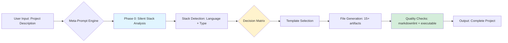
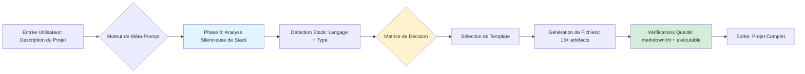

# 🚀 Advanced Prompts Factory

<div align="center">

**Enterprise-grade meta-prompts for GitHub projects**  
**Méta-prompts de niveau Enterprise pour projets GitHub**

[](https://opensource.org/licenses/MIT)
[](https://www.markdownguide.org/)
[](https://github.com/PowerShell/PowerShell)
[](CONTRIBUTING.md)
[](https://github.com/valorisa/Advanced-Prompts-Factory/graphs/commit-activity)

[Quick Start](#-quick-start--démarrage-rapide) •
[Documentation](#-documentation--documentation-complète) •
[Prompts](#-available-prompts--prompts-disponibles) •
[Contributing](#-contributing--contribution) •
[License](#-license--licence)

</div>

---

## 🌟 Overview / Vue d'ensemble

### English

**Advanced Prompts Factory** is a curated collection of production-ready meta-prompts designed to generate complete, enterprise-grade GitHub projects in a single step. Born from the need to eliminate generic placeholders and stack-agnostic templates, this factory provides intelligent, context-aware prompts that adapt to your technology stack while maintaining strict quality standards.

**The Problem**: Most project generators produce generic skeletons filled with `[TODO]`, `[Your description here]`, and placeholder code that doesn't run. Developers waste hours customizing templates manually, fighting with mismatched stack configurations, and fixing linter violations.

**The Solution**: Meta-prompts that perform silent stack analysis before generation, producing real, executable code tailored to your specific technology (PowerShell, Node.js, Python, Nix, etc.) with zero placeholders. Every command works out-of-the-box, every CI/CD pipeline runs correctly, every `.gitignore` matches your stack.

**Key Benefits**:

- ⚡ **Zero-placeholder generation**: All files contain real, functional content
- 🎯 **Stack-aware intelligence**: Automatic adaptation to 10+ technology stacks
- 🌍 **Bilingual by design**: EN/US + FR documentation in every project
- 🏆 **Enterprise standards**: markdownlint compliance, Conventional Commits, security policies
- 📦 **15+ files per project**: Complete GitHub ecosystem (CI/CD, templates, docs, security)

**Target Audience**: Solo developers, open-source maintainers, and enterprise teams who value quality, consistency, and speed in their project scaffolding.

### Français

**Advanced Prompts Factory** est une collection soigneusement élaborée de méta-prompts prêts pour la production, conçus pour générer des projets GitHub complets de niveau Enterprise en une seule étape. Né du besoin d'éliminer les placeholders génériques et les templates agnostiques de stack, cette factory fournit des prompts intelligents et conscients du contexte qui s'adaptent à votre stack technologique tout en maintenant des standards de qualité stricts.

**Le Problème** : La plupart des générateurs de projets produisent des squelettes génériques remplis de `[TODO]`, `[Votre description ici]` et de code placeholder qui ne fonctionne pas. Les développeurs perdent des heures à personnaliser manuellement les templates, à se battre avec des configurations de stack incompatibles et à corriger des violations de linter.

**La Solution** : Des méta-prompts qui effectuent une analyse silencieuse de la stack avant la génération, produisant du code réel et exécutable adapté à votre technologie spécifique (PowerShell, Node.js, Python, Nix, etc.) avec zéro placeholder. Chaque commande fonctionne immédiatement, chaque pipeline CI/CD s'exécute correctement, chaque `.gitignore` correspond à votre stack.

**Bénéfices Clés** :

- ⚡ **Génération sans placeholder** : Tous les fichiers contiennent du contenu réel et fonctionnel
- 🎯 **Intelligence stack-aware** : Adaptation automatique à plus de 10 stacks technologiques
- 🌍 **Bilingue par conception** : Documentation EN/US + FR dans chaque projet
- 🏆 **Standards Enterprise** : Conformité markdownlint, Conventional Commits, politiques de sécurité
- 📦 **15+ fichiers par projet** : Écosystème GitHub complet (CI/CD, templates, docs, sécurité)

**Public Cible** : Développeurs solo, mainteneurs open-source et équipes enterprise qui valorisent la qualité, la cohérence et la rapidité dans la création de leurs projets.

---

## ✨ Features / Fonctionnalités

### English

- 🎯 **RepoArchitect Pro**: The flagship meta-prompt for generating complete GitHub repositories with stack-specific configurations, bilingual READMEs, and real CI/CD pipelines. Supports PowerShell, Node.js, Python, Nix, Bash, and more.

- ⚡ **Silent Stack Analysis**: Pre-generation intelligence layer that detects your project type (CLI tool, library, API, web app) and technology stack, then tailors every file accordingly—no user interaction required.

- 🛡️ **Zero-Placeholder Guarantee**: Every generated file contains executable code. Commands run as-is, tests pass, CI/CD deploys. No `[TODO]` comments, no `[Setup steps]` sections—only production-ready content.

- 🚀 **One-Step Generation**: Paste a meta-prompt into any LLM, describe your project in one sentence, and receive 15+ fully-formed files instantly. No iterative back-and-forth, no manual template customization.

- 💡 **Extensible Architecture**: Add your own meta-prompts to the collection following our standardized template. Each prompt includes version tracking, usage statistics, and stack compatibility matrices.

### Français

- 🎯 **RepoArchitect Pro** : Le méta-prompt phare pour générer des dépôts GitHub complets avec des configurations spécifiques à la stack, des READMEs bilingues et de véritables pipelines CI/CD. Supporte PowerShell, Node.js, Python, Nix, Bash et plus encore.

- ⚡ **Analyse Silencieuse de Stack** : Couche d'intelligence pré-génération qui détecte votre type de projet (CLI tool, library, API, web app) et votre stack technologique, puis adapte chaque fichier en conséquence—aucune interaction utilisateur requise.

- 🛡️ **Garantie Zéro-Placeholder** : Chaque fichier généré contient du code exécutable. Les commandes fonctionnent telles quelles, les tests passent, le CI/CD déploie. Pas de commentaires `[TODO]`, pas de sections `[Setup steps]`—uniquement du contenu prêt pour la production.

- 🚀 **Génération en Une Étape** : Collez un méta-prompt dans n'importe quel LLM, décrivez votre projet en une phrase et recevez instantanément plus de 15 fichiers entièrement formés. Pas d'aller-retour itératif, pas de personnalisation manuelle de template.

- 💡 **Architecture Extensible** : Ajoutez vos propres méta-prompts à la collection en suivant notre template standardisé. Chaque prompt inclut le suivi des versions, les statistiques d'utilisation et les matrices de compatibilité de stack.

---

## 🚀 Quick Start / Démarrage Rapide

### English

#### Prerequisites

- **Git** 2.30+ (for cloning and version control)
- **LLM Access** (Claude 3.5+, GPT-4, or compatible API)
- **Text Editor** (VS Code, Vim, or any markdown-compatible editor)
- **Optional**: PowerShell 7.6+ (for automation scripts)

#### Installation

```bash
# Clone the repository
git clone https://github.com/valorisa/Advanced-Prompts-Factory.git
cd Advanced-Prompts-Factory

# Browse available prompts
ls -l prompts/

# Copy your desired meta-prompt
cat prompts/repoarchitect-pro.md

# Paste into your LLM and describe your project
# Example: "Generate a PowerShell CLI tool for parsing log files"
```

> [!TIP]
> **Pro tip**: Start with `repoarchitect-pro.md` for your first project. It's the most mature and battle-tested prompt in the collection, supporting 10+ technology stacks out-of-the-box.

### Français

#### Prérequis

- **Git** 2.30+ (pour le clonage et le contrôle de version)
- **Accès LLM** (Claude 3.5+, GPT-4 ou API compatible)
- **Éditeur de Texte** (VS Code, Vim ou tout éditeur compatible markdown)
- **Optionnel** : PowerShell 7.6+ (pour les scripts d'automatisation)

#### Installation

```bash
# Cloner le dépôt
git clone https://github.com/valorisa/Advanced-Prompts-Factory.git
cd Advanced-Prompts-Factory

# Parcourir les prompts disponibles
ls -l prompts/

# Copier votre méta-prompt désiré
cat prompts/repoarchitect-pro.md

# Coller dans votre LLM et décrire votre projet
# Exemple : "Génère un CLI tool PowerShell pour parser des fichiers de logs"
```

> [!CONSEIL]
> **Astuce de pro** : Commencez avec `repoarchitect-pro.md` pour votre premier projet. C'est le prompt le plus mature et le plus testé de la collection, supportant plus de 10 stacks technologiques prêtes à l'emploi.

---

## 📖 Documentation / Documentation Complète

### English

#### Architecture Overview

Advanced Prompts Factory follows a modular, template-driven architecture where each meta-prompt is a self-contained specification document:



**Component Breakdown**:

1. **Meta-Prompt Repository** (`prompts/`): Versioned collection of prompt templates, each with explicit stack support matrices
2. **Stack Detection Layer**: Embedded intelligence within prompts that identifies technology and project type
3. **Template Engine**: Conditional logic that swaps generic placeholders for stack-specific real code
4. **Quality Assurance**: Built-in checklists ensuring zero-placeholder delivery and linter compliance

#### Configuration Guide

Each meta-prompt can be customized via inline variables before pasting into your LLM:

```markdown
# Inside any prompt file, locate the configuration section:

## Configuration Variables (Modify before use)
- **DEFAULT_LICENSE**: MIT | Apache-2.0 | GPL-3.0 | Proprietary
- **BILINGUAL_MODE**: true | false (disable French translations if not needed)
- **MIN_FILE_COUNT**: 15 (increase for more comprehensive projects)
- **AUTHOR_USERNAME**: valorisa (replace with your GitHub username)
```

Alternatively, override at generation time by appending instructions:
> "Use Apache-2.0 license instead of MIT"

#### Troubleshooting

**Problem**: Generated CI/CD workflow fails with "command not found"  
**Solution**: The LLM may have hallucinated a command. Cross-check the workflow against the official GitHub Actions marketplace for your stack's action (e.g., `actions/setup-node@v4` for Node.js).

**Problem**: README contains `[TODO]` placeholders despite using zero-placeholder prompts  
**Solution**: Your LLM may be outdated or context-limited. Try:

1. Use a more recent model (Claude 3.5 Sonnet or GPT-4 Turbo)
2. Split the generation into two passes: structure first, then content fill
3. Explicitly add "Replace ALL placeholders with real content" to your user message

**Problem**: `.gitignore` doesn't match my stack (e.g., Python project has Node.js ignores)  
**Solution**: The stack detection failed. Be explicit in your project description:
> ❌ "Generate a data processing tool"  
> ✅ "Generate a Python CLI tool using Click for CSV data processing"

**Problem**: Generated project is too verbose / too minimal  
**Solution**: Adjust the verbosity instruction in the meta-prompt:

- For minimal: Change "README > 2000 words" to "README 500-800 words"
- For verbose: Add "Include inline code comments explaining complex logic"

**Problem**: Bilingual sections are missing or incomplete  
**Solution**: The LLM ran out of context or tokens. Try:

1. Generate in two phases: EN-only first, then translate FR sections separately
2. Use a model with larger context (200K+ tokens)
3. Remove less critical files (e.g., `docs/api.md`) to free up generation budget

### Français

#### Aperçu de l'Architecture

Advanced Prompts Factory suit une architecture modulaire et basée sur des templates où chaque méta-prompt est un document de spécification autonome :



**Décomposition des Composants** :

1. **Dépôt de Méta-Prompts** (`prompts/`) : Collection versionnée de templates de prompts, chacun avec des matrices de support de stack explicites
2. **Couche de Détection de Stack** : Intelligence embarquée dans les prompts qui identifie la technologie et le type de projet
3. **Moteur de Template** : Logique conditionnelle qui remplace les placeholders génériques par du code réel spécifique à la stack
4. **Assurance Qualité** : Checklists intégrées garantissant une livraison sans placeholder et conforme au linter

#### Guide de Configuration

Chaque méta-prompt peut être personnalisé via des variables inline avant de le coller dans votre LLM :

```markdown
# Dans n'importe quel fichier de prompt, localisez la section de configuration :

## Variables de Configuration (Modifier avant utilisation)
- **DEFAULT_LICENSE**: MIT | Apache-2.0 | GPL-3.0 | Proprietary
- **BILINGUAL_MODE**: true | false (désactiver les traductions françaises si non nécessaire)
- **MIN_FILE_COUNT**: 15 (augmenter pour des projets plus complets)
- **AUTHOR_USERNAME**: valorisa (remplacer par votre nom d'utilisateur GitHub)
```

Alternativement, remplacez lors de la génération en ajoutant des instructions :
> "Utilise la licence Apache-2.0 au lieu de MIT"

#### Dépannage

**Problème** : Le workflow CI/CD généré échoue avec "command not found"  
**Solution** : Le LLM a peut-être halluciné une commande. Vérifiez le workflow avec le marketplace officiel GitHub Actions pour l'action de votre stack (ex: `actions/setup-node@v4` pour Node.js).

**Problème** : Le README contient des placeholders `[TODO]` malgré l'utilisation de prompts zéro-placeholder  
**Solution** : Votre LLM est peut-être obsolète ou limité en contexte. Essayez :

1. Utilisez un modèle plus récent (Claude 3.5 Sonnet ou GPT-4 Turbo)
2. Divisez la génération en deux passes : structure d'abord, puis remplissage du contenu
3. Ajoutez explicitement "Remplace TOUS les placeholders par du contenu réel" à votre message utilisateur

**Problème** : Le `.gitignore` ne correspond pas à ma stack (ex: projet Python avec des ignores Node.js)  
**Solution** : La détection de stack a échoué. Soyez explicite dans votre description de projet :
> ❌ "Génère un outil de traitement de données"  
> ✅ "Génère un CLI tool Python utilisant Click pour le traitement de données CSV"

**Problème** : Le projet généré est trop verbeux / trop minimal  
**Solution** : Ajustez l'instruction de verbosité dans le méta-prompt :

- Pour minimal : Changez "README > 2000 mots" en "README 500-800 mots"
- Pour verbeux : Ajoutez "Inclure des commentaires de code inline expliquant la logique complexe"

**Problème** : Les sections bilingues sont manquantes ou incomplètes  
**Solution** : Le LLM a manqué de contexte ou de tokens. Essayez :

1. Générez en deux phases : EN-seulement d'abord, puis traduisez les sections FR séparément
2. Utilisez un modèle avec un contexte plus large (200K+ tokens)
3. Retirez des fichiers moins critiques (ex: `docs/api.md`) pour libérer du budget de génération

---

## 🛠️ Development / Développement Local

### English

#### Adding a New Meta-Prompt

1. **Create the prompt file**:

   ```powershell
   # From repository root
   New-Item -Path "prompts/my-new-prompt.md" -ItemType File
   ```

2. **Follow the standard template**:

   ```markdown
   # Prompt Name
   ## Version: 1.0.0
   ## Stacks Supported: [list]
   ## Project Types: [list]
   
   [Your prompt content following RepoArchitect structure]
   ```

3. **Add metadata entry** to `docs/prompts-index.md`:

   ```markdown
   | my-new-prompt | Description | v1.0.0 | Stack1, Stack2 | Type1, Type2 |
   ```

4. **Test the prompt** with at least 3 different project descriptions covering different stacks

5. **Submit a PR** following [CONTRIBUTING.md](CONTRIBUTING.md)

#### Project Structure

```
Advanced-Prompts-Factory/
├── prompts/                     # Meta-prompt collection
│   ├── repoarchitect-pro.md    # Flagship prompt
│   └── [future-prompts].md
├── docs/
│   ├── architecture.md          # System design documentation
│   ├── prompts-index.md         # Catalog of all prompts
│   └── usage-examples.md        # Real-world usage demonstrations
├── scripts/                     # Automation utilities
│   └── Make.ps1                # Build, test, validate commands
├── .github/
│   ├── workflows/
│   │   ├── ci.yml              # Markdown linting + link checking
│   │   └── release.yml         # Semantic versioning automation
│   └── ISSUE_TEMPLATE/
└── README.md                    # You are here
```

#### Running Validations Locally

```powershell
# Load the Make.ps1 functions
. ./scripts/Make.ps1

# Validate all markdown files
Invoke-Lint

# Check for broken links
Invoke-LinkCheck

# Run full quality suite
Invoke-Test
```

### Français

#### Ajouter un Nouveau Méta-Prompt

1. **Créer le fichier de prompt** :

   ```powershell
   # Depuis la racine du dépôt
   New-Item -Path "prompts/mon-nouveau-prompt.md" -ItemType File
   ```

2. **Suivre le template standard** :

   ```markdown
   # Nom du Prompt
   ## Version: 1.0.0
   ## Stacks Supportées: [liste]
   ## Types de Projets: [liste]
   
   [Votre contenu de prompt suivant la structure RepoArchitect]
   ```

3. **Ajouter une entrée de métadonnées** dans `docs/prompts-index.md` :

   ```markdown
   | mon-nouveau-prompt | Description | v1.0.0 | Stack1, Stack2 | Type1, Type2 |
   ```

4. **Tester le prompt** avec au moins 3 descriptions de projets différentes couvrant différentes stacks

5. **Soumettre une PR** en suivant [CONTRIBUTING.md](CONTRIBUTING.md)

#### Structure du Projet

```
Advanced-Prompts-Factory/
├── prompts/                     # Collection de méta-prompts
│   ├── repoarchitect-pro.md    # Prompt phare
│   └── [prompts-futurs].md
├── docs/
│   ├── architecture.md          # Documentation de conception système
│   ├── prompts-index.md         # Catalogue de tous les prompts
│   └── usage-examples.md        # Démonstrations d'usage réel
├── scripts/                     # Utilitaires d'automatisation
│   └── Make.ps1                # Commandes build, test, validate
├── .github/
│   ├── workflows/
│   │   ├── ci.yml              # Linting markdown + vérification des liens
│   │   └── release.yml         # Automatisation du versioning sémantique
│   └── ISSUE_TEMPLATE/
└── README.md                    # Vous êtes ici
```

#### Exécuter les Validations Localement

```powershell
# Charger les fonctions Make.ps1
. ./scripts/Make.ps1

# Valider tous les fichiers markdown
Invoke-Lint

# Vérifier les liens cassés
Invoke-LinkCheck

# Exécuter la suite qualité complète
Invoke-Test
```

---

## 🧪 Testing / Tests

### English

```powershell
# Run markdown linting
Invoke-Lint

# Check for broken internal/external links
Invoke-LinkCheck

# Validate all prompts have required metadata
Invoke-ValidatePrompts

# Full test suite
Invoke-Test
```

**Testing Strategy**:

- **Linting**: `markdownlint-cli2` with `.markdownlint.json` config for zero-violation enforcement
- **Link Checking**: Automated verification of all URLs and internal references
- **Metadata Validation**: Ensures every prompt file includes version, stack support, and usage stats
- **Manual Smoke Tests**: Each prompt tested with 3+ real project descriptions before release

### Français

```powershell
# Exécuter le linting markdown
Invoke-Lint

# Vérifier les liens internes/externes cassés
Invoke-LinkCheck

# Valider que tous les prompts ont les métadonnées requises
Invoke-ValidatePrompts

# Suite de tests complète
Invoke-Test
```

**Stratégie de Test** :

- **Linting** : `markdownlint-cli2` avec config `.markdownlint.json` pour une application zéro-violation
- **Vérification des Liens** : Vérification automatisée de toutes les URLs et références internes
- **Validation des Métadonnées** : Garantit que chaque fichier de prompt inclut version, support de stack et statistiques d'usage
- **Tests Manuels de Fumée** : Chaque prompt testé avec 3+ descriptions de projets réels avant publication

---

## 🚢 Deployment / Déploiement

### English

This repository is documentation-only and doesn't require deployment. However, if you're integrating these prompts into an automated service:

1. **API Integration**: Wrap prompts as API endpoints using your preferred framework (Express, FastAPI, Flask)
2. **Versioning**: Use GitHub releases to tag stable prompt versions
3. **CDN Distribution**: Host `prompts/` directory on a CDN for low-latency access
4. **Analytics**: Track usage with custom headers or query params to measure prompt effectiveness

**Example Integration** (Node.js):

```javascript
const fs = require('fs');
const express = require('express');
const app = express();

app.get('/prompt/:name', (req, res) => {
  const prompt = fs.readFileSync(`./prompts/${req.params.name}.md`, 'utf8');
  res.type('text/markdown').send(prompt);
});

app.listen(3000);
```

### Français

Ce dépôt est documentation-seulement et ne nécessite pas de déploiement. Cependant, si vous intégrez ces prompts dans un service automatisé :

1. **Intégration API** : Enveloppez les prompts comme endpoints API en utilisant votre framework préféré (Express, FastAPI, Flask)
2. **Versioning** : Utilisez les releases GitHub pour tagger les versions stables de prompts
3. **Distribution CDN** : Hébergez le répertoire `prompts/` sur un CDN pour un accès à faible latence
4. **Analytiques** : Suivez l'usage avec des headers personnalisés ou paramètres de requête pour mesurer l'efficacité des prompts

**Exemple d'Intégration** (Node.js) :

```javascript
const fs = require('fs');
const express = require('express');
const app = express();

app.get('/prompt/:name', (req, res) => {
  const prompt = fs.readFileSync(`./prompts/${req.params.name}.md`, 'utf8');
  res.type('text/markdown').send(prompt);
});

app.listen(3000);
```

---

## 🤝 Contributing / Contribution

We welcome contributions! Please see [CONTRIBUTING.md](CONTRIBUTING.md) for detailed guidelines.

**Quick checklist**:

- [ ] New prompts follow the standard template structure
- [ ] All markdown passes `markdownlint` validation
- [ ] Prompts tested with 3+ different project types
- [ ] Metadata added to `docs/prompts-index.md`
- [ ] Commit messages follow Conventional Commits format

Nous accueillons les contributions ! Veuillez consulter [CONTRIBUTING.md](CONTRIBUTING.md) pour des directives détaillées.

**Checklist rapide** :

- [ ] Les nouveaux prompts suivent la structure de template standard
- [ ] Tout le markdown passe la validation `markdownlint`
- [ ] Prompts testés avec 3+ types de projets différents
- [ ] Métadonnées ajoutées dans `docs/prompts-index.md`
- [ ] Messages de commit suivent le format Conventional Commits

---

## 📝 Changelog / Journal des Modifications

See [CHANGELOG.md](CHANGELOG.md) • Consultez [CHANGELOG.md](CHANGELOG.md)

---

## 🛡️ Security / Sécurité

See [SECURITY.md](SECURITY.md) • Consultez [SECURITY.md](SECURITY.md)

---

## 📄 License / Licence

[MIT License](LICENSE) • [Licence MIT](LICENSE)

This project is open-source and free to use. Attribution appreciated but not required.

Ce projet est open-source et libre d'utilisation. L'attribution est appréciée mais non requise.

---

## 👥 Team / Équipe

- **valorisa** — *Author & Maintainer* — [GitHub](https://github.com/valorisa)

---

## 🎯 Available Prompts / Prompts Disponibles

| Prompt Name | Description | Version | Stacks | Types |
|-------------|-------------|---------|--------|-------|
| [RepoArchitect Pro](prompts/repoarchitect-pro.md) | Complete GitHub project generation with stack-aware intelligence | 2.0.0 | PowerShell, Node.js, Python, Nix, Bash, Shell | CLI, Library, API, Web App, Scripts |

See [docs/prompts-index.md](docs/prompts-index.md) for detailed comparison and usage examples.

Consultez [docs/prompts-index.md](docs/prompts-index.md) pour une comparaison détaillée et des exemples d'usage.

---

## ❓ FAQ / Questions Fréquentes

### English

**Q: Can I use these prompts with any LLM, or are they specific to Claude/GPT-4?**  
A: The prompts are LLM-agnostic and tested with Claude 3.5, GPT-4, and compatible models. However, best results require models with 100K+ context windows and strong instruction-following capabilities. Smaller models (7B-13B parameters) may produce incomplete or placeholder-heavy output.

**Q: Do I need to credit Advanced Prompts Factory when using these prompts?**  
A: No. The MIT license allows unrestricted use without attribution. However, if you found a prompt valuable, a star ⭐ on the repo helps others discover it!

**Q: Why are some generated files still generic despite using RepoArchitect Pro?**  
A: Two common causes: (1) Your project description lacks stack details—be explicit about your language and tools. (2) Your LLM ran out of tokens mid-generation—try a model with larger context or split generation into phases.

**Q: Can I modify a prompt to remove the bilingual requirement?**  
A: Absolutely. Locate the `# Instructions de Génération` section in any prompt and change `6. **Bilingue EN/FR**` to `6. **English-only**`. This reduces token usage by ~30-40%.

**Q: How do I contribute a new prompt to the factory?**  
A: See [CONTRIBUTING.md](CONTRIBUTING.md) for the full process. In short: fork the repo, add your prompt to `prompts/`, update `docs/prompts-index.md`, test with 3+ examples, and submit a PR. We review within 48 hours.

**Q: Is there a CLI tool to automate using these prompts?**  
A: Not yet, but it's on the roadmap! Track progress in [issue #1](https://github.com/valorisa/Advanced-Prompts-Factory/issues/1). In the meantime, you can create a simple wrapper script using PowerShell or Bash to automate clipboard copying.

### Français

**Q : Puis-je utiliser ces prompts avec n'importe quel LLM, ou sont-ils spécifiques à Claude/GPT-4 ?**  
R : Les prompts sont agnostiques de LLM et testés avec Claude 3.5, GPT-4 et des modèles compatibles. Cependant, les meilleurs résultats nécessitent des modèles avec des fenêtres de contexte de 100K+ et de fortes capacités de suivi d'instructions. Les modèles plus petits (7B-13B paramètres) peuvent produire une sortie incomplète ou riche en placeholders.

**Q : Dois-je créditer Advanced Prompts Factory lors de l'utilisation de ces prompts ?**  
R : Non. La licence MIT permet une utilisation sans restriction sans attribution. Cependant, si vous avez trouvé un prompt précieux, une étoile ⭐ sur le repo aide les autres à le découvrir !

**Q : Pourquoi certains fichiers générés sont-ils encore génériques malgré l'utilisation de RepoArchitect Pro ?**  
R : Deux causes courantes : (1) Votre description de projet manque de détails de stack—soyez explicite sur votre langage et vos outils. (2) Votre LLM a manqué de tokens en cours de génération—essayez un modèle avec un contexte plus large ou divisez la génération en phases.

**Q : Puis-je modifier un prompt pour retirer l'exigence bilingue ?**  
R : Absolument. Localisez la section `# Instructions de Génération` dans n'importe quel prompt et changez `6. **Bilingue EN/FR**` en `6. **Anglais uniquement**`. Cela réduit l'usage de tokens de ~30-40%.

**Q : Comment puis-je contribuer un nouveau prompt à la factory ?**  
R : Consultez [CONTRIBUTING.md](CONTRIBUTING.md) pour le processus complet. En bref : forkez le repo, ajoutez votre prompt dans `prompts/`, mettez à jour `docs/prompts-index.md`, testez avec 3+ exemples et soumettez une PR. Nous révisons dans les 48 heures.

**Q : Existe-t-il un CLI tool pour automatiser l'utilisation de ces prompts ?**  
R : Pas encore, mais c'est sur la roadmap ! Suivez les progrès dans [issue #1](https://github.com/valorisa/Advanced-Prompts-Factory/issues/1). En attendant, vous pouvez créer un simple script wrapper en PowerShell ou Bash pour automatiser la copie du presse-papiers.

---

<p align="center">
  <strong>Made with ❤️ by valorisa</strong><br>
  <em>Fait avec ❤️ par valorisa</em>
</p>
