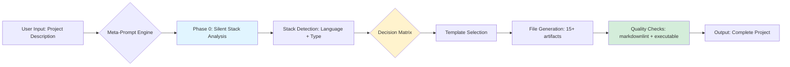

# 🚀 Advanced Prompts Factory

<div align="center">

**Enterprise-grade meta-prompts for GitHub projects**

[](https://opensource.org/licenses/MIT)
[](https://www.markdownguide.org/)
[](https://github.com/PowerShell/PowerShell)
[](CONTRIBUTING.md)
[](https://github.com/valorisa/Advanced-Prompts-Factory/graphs/commit-activity)

[Quick Start](#-quick-start) •
[Documentation](#-documentation) •
[Prompts](#-available-prompts) •
[Contributing](#-contributing) •
[License](#-license)

</div>

---

## 🌟 Overview

**Advanced Prompts Factory** is a curated collection of production-ready meta-prompts designed to generate complete, enterprise-grade GitHub projects in a single step. Born from the need to eliminate generic placeholders and stack-agnostic templates, this factory provides intelligent, context-aware prompts that adapt to your technology stack while maintaining strict quality standards.

**The Problem**: Most project generators produce generic skeletons filled with `[TODO]`, `[Your description here]`, and placeholder code that doesn't run. Developers waste hours customizing templates manually, fighting with mismatched stack configurations, and fixing linter violations.

**The Solution**: Meta-prompts that perform silent stack analysis before generation, producing real, executable code tailored to your specific technology (PowerShell, Node.js, Python, Nix, etc.) with zero placeholders. Every command works out-of-the-box, every CI/CD pipeline runs correctly, every `.gitignore` matches your stack.

**Key Benefits**:

- ⚡ **Zero-placeholder generation**: All files contain real, functional content
- 🎯 **Stack-aware intelligence**: Automatic adaptation to 10+ technology stacks
- 🌍 **Bilingual by design**: EN/US + FR documentation in every project
- 🏆 **Enterprise standards**: markdownlint compliance, Conventional Commits, security policies
- 📦 **15+ files per project**: Complete GitHub ecosystem (CI/CD, templates, docs, security)

**Target Audience**: Solo developers, open-source maintainers, and enterprise teams who value quality, consistency, and speed in their project scaffolding.

---

## ✨ Features

- 🎯 **RepoArchitect Pro**: The flagship meta-prompt for generating complete GitHub repositories with stack-specific configurations, bilingual READMEs, and real CI/CD pipelines. Supports PowerShell, Node.js, Python, Nix, Bash, and more.

- ⚡ **Silent Stack Analysis**: Pre-generation intelligence layer that detects your project type (CLI tool, library, API, web app) and technology stack, then tailors every file accordingly—no user interaction required.

- 🛡️ **Zero-Placeholder Guarantee**: Every generated file contains executable code. Commands run as-is, tests pass, CI/CD deploys. No `[TODO]` comments, no `[Setup steps]` sections—only production-ready content.

- 🚀 **One-Step Generation**: Paste a meta-prompt into any LLM, describe your project in one sentence, and receive 15+ fully-formed files instantly. No iterative back-and-forth, no manual template customization.

- 💡 **Extensible Architecture**: Add your own meta-prompts to the collection following our standardized template. Each prompt includes version tracking, usage statistics, and stack compatibility matrices.

---

## 🚀 Quick Start

### Prerequisites

- **Git** 2.30+ (for cloning and version control)
- **LLM Access** (Claude 3.5+, GPT-4, or compatible API)
- **Text Editor** (VS Code, Vim, or any markdown-compatible editor)
- **Optional**: PowerShell 7.6+ (for automation scripts)

### Installation

```bash
# Clone the repository
git clone https://github.com/valorisa/Advanced-Prompts-Factory.git
cd Advanced-Prompts-Factory

# Browse available prompts
ls -l prompts/

# Copy your desired meta-prompt
cat prompts/repoarchitect-pro.md

# Paste into your LLM and describe your project
# Example: "Generate a PowerShell CLI tool for parsing log files"
```

> [!TIP]
> **Pro tip**: Start with `repoarchitect-pro.md` for your first project. It's the most mature and battle-tested prompt in the collection, supporting 10+ technology stacks out-of-the-box.

---

## 📖 Documentation

### Architecture Overview

Advanced Prompts Factory follows a modular, template-driven architecture where each meta-prompt is a self-contained specification document:



**Component Breakdown**:

1. **Meta-Prompt Repository** (`prompts/`): Versioned collection of prompt templates, each with explicit stack support matrices
2. **Stack Detection Layer**: Embedded intelligence within prompts that identifies technology and project type
3. **Template Engine**: Conditional logic that swaps generic placeholders for stack-specific real code
4. **Quality Assurance**: Built-in checklists ensuring zero-placeholder delivery and linter compliance

### Configuration Guide

Each meta-prompt can be customized via inline variables before pasting into your LLM:

```markdown
# Inside any prompt file, locate the configuration section:

## Configuration Variables (Modify before use)
- **DEFAULT_LICENSE**: MIT | Apache-2.0 | GPL-3.0 | Proprietary
- **BILINGUAL_MODE**: true | false (disable French translations if not needed)
- **MIN_FILE_COUNT**: 15 (increase for more comprehensive projects)
- **AUTHOR_USERNAME**: valorisa (replace with your GitHub username)
```

Alternatively, override at generation time by appending instructions:
> "Use Apache-2.0 license instead of MIT"

### Troubleshooting

**Problem**: Generated CI/CD workflow fails with "command not found"  
**Solution**: The LLM may have hallucinated a command. Cross-check the workflow against the official GitHub Actions marketplace for your stack's action (e.g., `actions/setup-node@v4` for Node.js).

**Problem**: README contains `[TODO]` placeholders despite using zero-placeholder prompts  
**Solution**: Your LLM may be outdated or context-limited. Try:

1. Use a more recent model (Claude 3.5 Sonnet or GPT-4 Turbo)
2. Split the generation into two passes: structure first, then content fill
3. Explicitly add "Replace ALL placeholders with real content" to your user message

**Problem**: `.gitignore` doesn't match my stack (e.g., Python project has Node.js ignores)  
**Solution**: The stack detection failed. Be explicit in your project description:
> ❌ "Generate a data processing tool"  
> ✅ "Generate a Python CLI tool using Click for CSV data processing"

**Problem**: Generated project is too verbose / too minimal  
**Solution**: Adjust the verbosity instruction in the meta-prompt:

- For minimal: Change "README > 2000 words" to "README 500-800 words"
- For verbose: Add "Include inline code comments explaining complex logic"

**Problem**: Bilingual sections are missing or incomplete  
**Solution**: The LLM ran out of context or tokens. Try:

1. Generate in two phases: EN-only first, then translate FR sections separately
2. Use a model with larger context (200K+ tokens)
3. Remove less critical files (e.g., `docs/api.md`) to free up generation budget

---

## 🛠️ Development

### Adding a New Meta-Prompt

1. **Create the prompt file**:

   ```powershell
   # From repository root
   New-Item -Path "prompts/my-new-prompt.md" -ItemType File
   ```

2. **Follow the standard template**:

   ```markdown
   # Prompt Name
   ## Version: 1.0.0
   ## Stacks Supported: [list]
   ## Project Types: [list]
   
   [Your prompt content following RepoArchitect structure]
   ```

3. **Add metadata entry** to `docs/prompts-index.md`:

   ```markdown
   | my-new-prompt | Description | v1.0.0 | Stack1, Stack2 | Type1, Type2 |
   ```

4. **Test the prompt** with at least 3 different project descriptions covering different stacks

5. **Submit a PR** following [CONTRIBUTING.md](CONTRIBUTING.md)

### Project Structure

```
Advanced-Prompts-Factory/
├── prompts/                     # Meta-prompt collection
│   ├── repoarchitect-pro.md    # Flagship prompt
│   └── [future-prompts].md
├── docs/
│   ├── architecture.md          # System design documentation
│   ├── prompts-index.md         # Catalog of all prompts
│   └── usage-examples.md        # Real-world usage demonstrations
├── scripts/                     # Automation utilities
│   └── Make.ps1                # Build, test, validate commands
├── .github/
│   ├── workflows/
│   │   ├── ci.yml              # Markdown linting + link checking
│   │   └── release.yml         # Semantic versioning automation
│   └── ISSUE_TEMPLATE/
└── README.md                    # You are here
```

### Running Validations Locally

```powershell
# Load the Make.ps1 functions
. ./scripts/Make.ps1

# Validate all markdown files
Invoke-Lint

# Check for broken links
Invoke-LinkCheck

# Run full quality suite
Invoke-Test
```

---

## 🧪 Testing

```powershell
# Run markdown linting
Invoke-Lint

# Check for broken internal/external links
Invoke-LinkCheck

# Validate all prompts have required metadata
Invoke-ValidatePrompts

# Full test suite
Invoke-Test
```

**Testing Strategy**:

- **Linting**: `markdownlint-cli2` with `.markdownlint.json` config for zero-violation enforcement
- **Link Checking**: Automated verification of all URLs and internal references
- **Metadata Validation**: Ensures every prompt file includes version, stack support, and usage stats
- **Manual Smoke Tests**: Each prompt tested with 3+ real project descriptions before release

---

## 🚢 Deployment

This repository is documentation-only and doesn't require deployment. However, if you're integrating these prompts into an automated service:

1. **API Integration**: Wrap prompts as API endpoints using your preferred framework (Express, FastAPI, Flask)
2. **Versioning**: Use GitHub releases to tag stable prompt versions
3. **CDN Distribution**: Host `prompts/` directory on a CDN for low-latency access
4. **Analytics**: Track usage with custom headers or query params to measure prompt effectiveness

**Example Integration** (Node.js):

```javascript
const fs = require('fs');
const express = require('express');
const app = express();

app.get('/prompt/:name', (req, res) => {
  const prompt = fs.readFileSync(`./prompts/${req.params.name}.md`, 'utf8');
  res.type('text/markdown').send(prompt);
});

app.listen(3000);
```

---

## 🤝 Contributing

We welcome contributions! Please see [CONTRIBUTING.md](CONTRIBUTING.md) for detailed guidelines.

**Quick checklist**:

- [ ] New prompts follow the standard template structure
- [ ] All markdown passes `markdownlint` validation
- [ ] Prompts tested with 3+ different project types
- [ ] Metadata added to `docs/prompts-index.md`
- [ ] Commit messages follow Conventional Commits format

---

## 📝 Changelog

See [CHANGELOG.md](CHANGELOG.md)

---

## 🛡️ Security

See [SECURITY.md](SECURITY.md)

---

## 📄 License

[MIT License](LICENSE)

This project is open-source and free to use. Attribution appreciated but not required.

---

## 👥 Team

- **valorisa** — *Author & Maintainer* — [GitHub](https://github.com/valorisa)

---

## 🎯 Available Prompts

| Prompt Name | Description | Version | Stacks | Types |
|-------------|-------------|---------|--------|-------|
| [RepoArchitect Pro](prompts/repoarchitect-pro.md) | Complete GitHub project generation with stack-aware intelligence | 2.0.0 | PowerShell, Node.js, Python, Nix, Bash, Shell | CLI, Library, API, Web App, Scripts |

See [docs/prompts-index.md](docs/prompts-index.md) for detailed comparison and usage examples.

---

## ❓ FAQ

**Q: Can I use these prompts with any LLM, or are they specific to Claude/GPT-4?**  
A: The prompts are LLM-agnostic and tested with Claude 3.5, GPT-4, and compatible models. However, best results require models with 100K+ context windows and strong instruction-following capabilities. Smaller models (7B-13B parameters) may produce incomplete or placeholder-heavy output.

**Q: Do I need to credit Advanced Prompts Factory when using these prompts?**  
A: No. The MIT license allows unrestricted use without attribution. However, if you found a prompt valuable, a star ⭐ on the repo helps others discover it!

**Q: Why are some generated files still generic despite using RepoArchitect Pro?**  
A: Two common causes: (1) Your project description lacks stack details—be explicit about your language and tools. (2) Your LLM ran out of tokens mid-generation—try a model with larger context or split generation into phases.

**Q: Can I modify a prompt to remove the bilingual requirement?**  
A: Absolutely. Locate the `# Instructions de Génération` section in any prompt and change `6. **Bilingue EN/FR**` to `6. **English-only**`. This reduces token usage by ~30-40%.

**Q: How do I contribute a new prompt to the factory?**  
A: See [CONTRIBUTING.md](CONTRIBUTING.md) for the full process. In short: fork the repo, add your prompt to `prompts/`, update `docs/prompts-index.md`, test with 3+ examples, and submit a PR. We review within 48 hours.

**Q: Is there a CLI tool to automate using these prompts?**  
A: Not yet, but it's on the roadmap! Track progress in [issue #1](https://github.com/valorisa/Advanced-Prompts-Factory/issues/1). In the meantime, you can create a simple wrapper script using PowerShell or Bash to automate clipboard copying.

---

<p align="center">
  <strong>Made with ❤️ by valorisa</strong>
</p>
