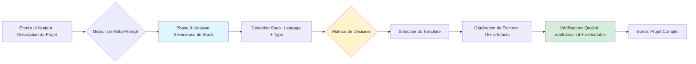

# 🚀 Advanced Prompts Factory

<div align="center">

**Méta-prompts de niveau Enterprise pour projets GitHub**

[](https://opensource.org/licenses/MIT)
[](https://www.markdownguide.org/)
[](https://github.com/PowerShell/PowerShell)
[](CONTRIBUTING.md)
[](https://github.com/valorisa/Advanced-Prompts-Factory/graphs/commit-activity)

[Démarrage Rapide](#-démarrage-rapide) •
[Documentation](#-documentation-complète) •
[Prompts](#-prompts-disponibles) •
[Contribution](#-contribution) •
[Licence](#-licence)

</div>

---

## 🌟 Vue d'ensemble

**Advanced Prompts Factory** est une collection soigneusement élaborée de méta-prompts prêts pour la production,
conçus pour générer des projets GitHub complets de niveau Enterprise en une seule étape. Né du besoin d'éliminer les
placeholders génériques et les templates agnostiques de stack, cette factory fournit des prompts intelligents et
conscients du contexte qui s'adaptent à votre stack technologique tout en maintenant des standards de qualité stricts.

**Le Problème** : La plupart des générateurs de projets produisent des squelettes génériques remplis de `[TODO]`,
`[Votre description ici]` et de code placeholder qui ne fonctionne pas. Les développeurs perdent des heures à
personnaliser manuellement les templates, à se battre avec des configurations de stack incompatibles et à corriger des
violations de linter.

**La Solution** : Des méta-prompts qui effectuent une analyse silencieuse de la stack avant la génération, produisant
du code réel et exécutable adapté à votre technologie spécifique (PowerShell, Node.js, Python, Nix, etc.) avec zéro
placeholder. Chaque commande fonctionne immédiatement, chaque pipeline CI/CD s'exécute correctement, chaque
`.gitignore` correspond à votre stack.

**Bénéfices Clés** :

- ⚡ **Génération sans placeholder** : Tous les fichiers contiennent du contenu réel et fonctionnel
- 🎯 **Intelligence stack-aware** : Adaptation automatique à plus de 10 stacks technologiques
- 🌍 **Bilingue par conception** : Documentation EN/US + FR dans chaque projet
- 🏆 **Standards Enterprise** : Conformité markdownlint, Conventional Commits, politiques de sécurité
- 📦 **15+ fichiers par projet** : Écosystème GitHub complet (CI/CD, templates, docs, sécurité)

**Public Cible** : Développeurs solo, mainteneurs open-source et équipes enterprise qui valorisent la qualité, la
cohérence et la rapidité dans la création de leurs projets.

---

## ✨ Fonctionnalités

- 🎯 **RepoArchitect Pro** : Le méta-prompt phare pour générer des dépôts GitHub complets avec des configurations
  spécifiques à la stack, des READMEs bilingues et de véritables pipelines CI/CD. Supporte PowerShell, Node.js,
  Python, Nix, Bash et plus encore.

- ⚡ **Analyse Silencieuse de Stack** : Couche d'intelligence pré-génération qui détecte votre type de projet
  (CLI tool, library, API, web app) et votre stack technologique, puis adapte chaque fichier en conséquence—aucune
  interaction utilisateur requise.

- 🛡️ **Garantie Zéro-Placeholder** : Chaque fichier généré contient du code exécutable. Les commandes fonctionnent
  telles quelles, les tests passent, le CI/CD déploie. Pas de commentaires `[TODO]`, pas de sections `[Setup steps]`
  —uniquement du contenu prêt pour la production.

- 🚀 **Génération en Une Étape** : Collez un méta-prompt dans n'importe quel LLM, décrivez votre projet en une phrase
  et recevez instantanément plus de 15 fichiers entièrement formés. Pas d'aller-retour itératif, pas de
  personnalisation manuelle de template.

- 💡 **Architecture Extensible** : Ajoutez vos propres méta-prompts à la collection en suivant notre template
  standardisé. Chaque prompt inclut le suivi des versions, les statistiques d'utilisation et les matrices de
  compatibilité de stack.

---

## 🚀 Démarrage Rapide

### Prérequis

- **Git** 2.30+ (pour le clonage et le contrôle de version)
- **Accès LLM** (Claude 3.5+, GPT-4 ou API compatible)
- **Éditeur de Texte** (VS Code, Vim ou tout éditeur compatible markdown)
- **Optionnel** : PowerShell 7.6+ (pour les scripts d'automatisation)

### Installation

```bash
# Cloner le dépôt
git clone https://github.com/valorisa/Advanced-Prompts-Factory.git
cd Advanced-Prompts-Factory

# Parcourir les prompts disponibles
ls -l prompts/

# Copier votre méta-prompt désiré
cat prompts/repoarchitect-pro.md

# Coller dans votre LLM et décrire votre projet
# Exemple : "Génère un CLI tool PowerShell pour parser des fichiers de logs"
```

> [!TIP]
> **Astuce de pro** : Commencez avec `repoarchitect-pro.md` pour votre premier projet. C'est le prompt le plus
> mature et le plus testé de la collection, supportant plus de 10 stacks technologiques prêtes à l'emploi.

---

## 📖 Documentation Complète

### Aperçu de l'Architecture

Advanced Prompts Factory suit une architecture modulaire et basée sur des templates où chaque méta-prompt est un
document de spécification autonome :



**Décomposition des Composants** :

1. **Dépôt de Méta-Prompts** (`prompts/`) : Collection versionnée de templates de prompts, chacun avec des matrices
   de support de stack explicites
2. **Couche de Détection de Stack** : Intelligence embarquée dans les prompts qui identifie la technologie et le type
   de projet
3. **Moteur de Template** : Logique conditionnelle qui remplace les placeholders génériques par du code réel
   spécifique à la stack
4. **Assurance Qualité** : Checklists intégrées garantissant une livraison sans placeholder et conforme au linter

### Guide de Configuration

Chaque méta-prompt peut être personnalisé via des variables inline avant de le coller dans votre LLM :

```markdown
# Dans n'importe quel fichier de prompt, localisez la section de configuration :

## Variables de Configuration (Modifier avant utilisation)
- **DEFAULT_LICENSE**: MIT | Apache-2.0 | GPL-3.0 | Proprietary
- **BILINGUAL_MODE**: true | false (désactiver les traductions françaises si non nécessaire)
- **MIN_FILE_COUNT**: 15 (augmenter pour des projets plus complets)
- **AUTHOR_USERNAME**: valorisa (remplacer par votre nom d'utilisateur GitHub)
```

Alternativement, remplacez lors de la génération en ajoutant des instructions :

> "Utilise la licence Apache-2.0 au lieu de MIT"

### Dépannage

**Problème** : Le workflow CI/CD généré échoue avec "command not found"  
**Solution** : Le LLM a peut-être halluciné une commande. Vérifiez le workflow avec le marketplace officiel GitHub
Actions pour l'action de votre stack (ex: `actions/setup-node@v4` pour Node.js).

**Problème** : Le README contient des placeholders `[TODO]` malgré l'utilisation de prompts zéro-placeholder  
**Solution** : Votre LLM est peut-être obsolète ou limité en contexte. Essayez :

1. Utilisez un modèle plus récent (Claude 3.5 Sonnet ou GPT-4 Turbo)
2. Divisez la génération en deux passes : structure d'abord, puis remplissage du contenu
3. Ajoutez explicitement "Remplace TOUS les placeholders par du contenu réel" à votre message utilisateur

**Problème** : Le `.gitignore` ne correspond pas à ma stack (ex: projet Python avec des ignores Node.js)  
**Solution** : La détection de stack a échoué. Soyez explicite dans votre description de projet :

> ❌ "Génère un outil de traitement de données"  
> ✅ "Génère un CLI tool Python utilisant Click pour le traitement de données CSV"

**Problème** : Le projet généré est trop verbeux / trop minimal  
**Solution** : Ajustez l'instruction de verbosité dans le méta-prompt :

- Pour minimal : Changez "README > 2000 mots" en "README 500-800 mots"
- Pour verbeux : Ajoutez "Inclure des commentaires de code inline expliquant la logique complexe"

**Problème** : Les sections bilingues sont manquantes ou incomplètes  
**Solution** : Le LLM a manqué de contexte ou de tokens. Essayez :

1. Générez en deux phases : EN-seulement d'abord, puis traduisez les sections FR séparément
2. Utilisez un modèle avec un contexte plus large (200K+ tokens)
3. Retirez des fichiers moins critiques (ex: `docs/api.md`) pour libérer du budget de génération

---

## 🛠️ Développement Local

### Ajouter un Nouveau Méta-Prompt

1. **Créer le fichier de prompt** :

   ```powershell
   # Depuis la racine du dépôt
   New-Item -Path "prompts/mon-nouveau-prompt.md" -ItemType File
   ```

2. **Suivre le template standard** :

   ```markdown
   # Nom du Prompt
   ## Version: 1.0.0
   ## Stacks Supportées: [liste]
   ## Types de Projets: [liste]
   
   [Votre contenu de prompt suivant la structure RepoArchitect]
   ```

3. **Ajouter une entrée de métadonnées** dans `docs/prompts-index.md` :

   ```markdown
   | mon-nouveau-prompt | Description | v1.0.0 | Stack1, Stack2 | Type1, Type2 |
   ```

4. **Tester le prompt** avec au moins 3 descriptions de projets différentes couvrant différentes stacks

5. **Soumettre une PR** en suivant [CONTRIBUTING.md](CONTRIBUTING.md)

### Structure du Projet

```text
Advanced-Prompts-Factory/
├── prompts/                     # Collection de méta-prompts
│   ├── repoarchitect-pro.md    # Prompt phare
│   └── [prompts-futurs].md
├── docs/
│   ├── architecture.md          # Documentation de conception système
│   ├── prompts-index.md         # Catalogue de tous les prompts
│   └── usage-examples.md        # Démonstrations d'usage réel
├── scripts/                     # Utilitaires d'automatisation
│   └── Make.ps1                # Commandes build, test, validate
├── .github/
│   ├── workflows/
│   │   ├── ci.yml              # Linting markdown + vérification des liens
│   │   └── release.yml         # Automatisation du versioning sémantique
│   └── ISSUE_TEMPLATE/
└── README.md                    # Vous êtes ici
```

### Exécuter les Validations Localement

```powershell
# Charger les fonctions Make.ps1
. ./scripts/Make.ps1

# Valider tous les fichiers markdown
Invoke-Lint

# Vérifier les liens cassés
Invoke-LinkCheck

# Valider les métadonnées des prompts
Invoke-ValidatePrompts

# Exécuter la suite qualité complète
Invoke-Test
```

---

## 🧪 Tests

```powershell
# Exécuter le linting markdown
Invoke-Lint

# Vérifier les liens internes/externes cassés
Invoke-LinkCheck

# Valider que tous les prompts ont les métadonnées requises
Invoke-ValidatePrompts

# Suite de tests complète
Invoke-Test
```

**Stratégie de Test** :

- **Linting** : `markdownlint-cli2` avec config `.markdownlint.json` pour une application zéro-violation
- **Vérification des Liens** : Vérification automatisée de toutes les URLs et références internes
- **Validation des Métadonnées** : Garantit que chaque fichier de prompt inclut version, support de stack et
  statistiques d'usage
- **Tests Manuels de Fumée** : Chaque prompt testé avec 3+ descriptions de projets réels avant publication

---

## 🚢 Déploiement

Ce dépôt est documentation-seulement et ne nécessite pas de déploiement. Cependant, si vous intégrez ces prompts dans
un service automatisé :

1. **Intégration API** : Enveloppez les prompts comme endpoints API en utilisant votre framework préféré (Express,
   FastAPI, Flask)
2. **Versioning** : Utilisez les releases GitHub pour tagger les versions stables de prompts
3. **Distribution CDN** : Hébergez le répertoire `prompts/` sur un CDN pour un accès à faible latence
4. **Analytiques** : Suivez l'usage avec des headers personnalisés ou paramètres de requête pour mesurer l'efficacité
   des prompts

**Exemple d'Intégration** (Node.js) :

```javascript
const fs = require('fs');
const express = require('express');
const app = express();

app.get('/prompt/:name', (req, res) => {
  const prompt = fs.readFileSync(`./prompts/${req.params.name}.md`, 'utf8');
  res.type('text/markdown').send(prompt);
});

app.listen(3000);
```

---

## 🤝 Contribution

Nous accueillons les contributions ! Veuillez consulter [CONTRIBUTING.md](CONTRIBUTING.md) pour des directives
détaillées.

**Checklist rapide** :

- [ ] Les nouveaux prompts suivent la structure de template standard
- [ ] Tout le markdown passe la validation `markdownlint`
- [ ] Prompts testés avec 3+ types de projets différents
- [ ] Métadonnées ajoutées dans `docs/prompts-index.md`
- [ ] Messages de commit suivent le format Conventional Commits

---

## 📝 Journal des Modifications

Consultez [CHANGELOG.md](CHANGELOG.md)

---

## 🛡️ Sécurité

Consultez [SECURITY.md](SECURITY.md)

---

## 📄 Licence

[Licence MIT](LICENSE)

Ce projet est open-source et libre d'utilisation. L'attribution est appréciée mais non requise.

---

## 👥 Équipe

- **valorisa** — *Auteur & Mainteneur* — [GitHub](https://github.com/valorisa)

---

## 🎯 Prompts Disponibles

| Nom du Prompt | Description | Version | Stacks | Types |
|---------------|-------------|---------|--------|-------|
| [RepoArchitect Pro](prompts/repoarchitect-pro.md) | Génération de projets GitHub complets avec intelligence stack-aware | v2.0.0 | PowerShell, Node.js, Python, Nix, Bash, Shell | CLI, Library, API, Web App, Scripts |

Consultez [docs/prompts-index.md](docs/prompts-index.md) pour une comparaison détaillée et des exemples d'usage.

---

## ❓ Questions Fréquentes

**Q : Puis-je utiliser ces prompts avec n'importe quel LLM, ou sont-ils spécifiques à Claude/GPT-4 ?**  
R : Les prompts sont agnostiques de LLM et testés avec Claude 3.5, GPT-4 et des modèles compatibles. Cependant, les
meilleurs résultats nécessitent des modèles avec des fenêtres de contexte de 100K+ et de fortes capacités de suivi
d'instructions. Les modèles plus petits (7B-13B paramètres) peuvent produire une sortie incomplète ou riche en
placeholders.

**Q : Dois-je créditer Advanced Prompts Factory lors de l'utilisation de ces prompts ?**  
R : Non. La licence MIT permet une utilisation sans restriction sans attribution. Cependant, si vous avez trouvé un
prompt précieux, une étoile ⭐ sur le repo aide les autres à le découvrir !

**Q : Pourquoi certains fichiers générés sont-ils encore génériques malgré l'utilisation de RepoArchitect Pro ?**  
R : Deux causes courantes : (1) Votre description de projet manque de détails de stack—soyez explicite sur votre
langage et vos outils. (2) Votre LLM a manqué de tokens en cours de génération—essayez un modèle avec un contexte plus
large ou divisez la génération en phases.

**Q : Puis-je modifier un prompt pour retirer l'exigence bilingue ?**  
R : Absolument. Localisez la section `# Instructions de Génération` dans n'importe quel prompt et changez
`6. **Bilingue EN/FR**` en `6. **Anglais uniquement**`. Cela réduit l'usage de tokens de ~30-40%.

**Q : Comment puis-je contribuer un nouveau prompt à la factory ?**  
R : Consultez [CONTRIBUTING.md](CONTRIBUTING.md) pour le processus complet. En bref : forkez le repo, ajoutez votre
prompt dans `prompts/`, mettez à jour `docs/prompts-index.md`, testez avec 3+ exemples et soumettez une PR. Nous
révisons dans les 48 heures.

**Q : Existe-t-il un CLI tool pour automatiser l'utilisation de ces prompts ?**  
R : Pas encore, mais c'est sur la roadmap ! Suivez les progrès dans
[issue #1](https://github.com/valorisa/Advanced-Prompts-Factory/issues/1). En attendant, vous pouvez créer un simple
script wrapper en PowerShell ou Bash pour automatiser la copie du presse-papiers.

---

<p align="center">
  <strong>Fait avec ❤️ par valorisa</strong>
</p>
