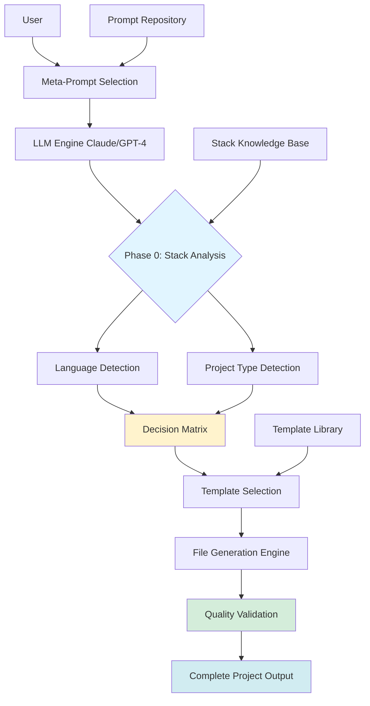
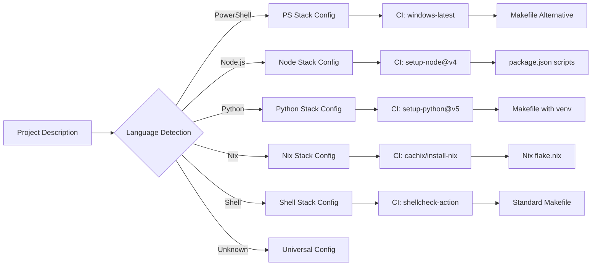
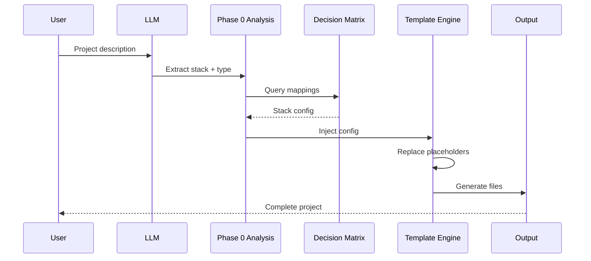
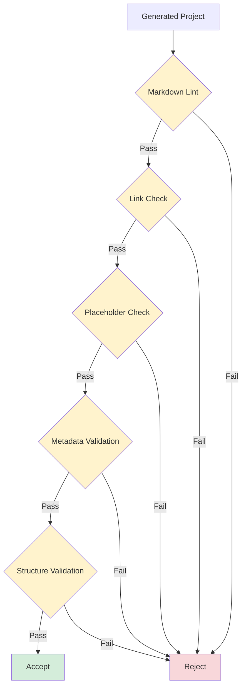
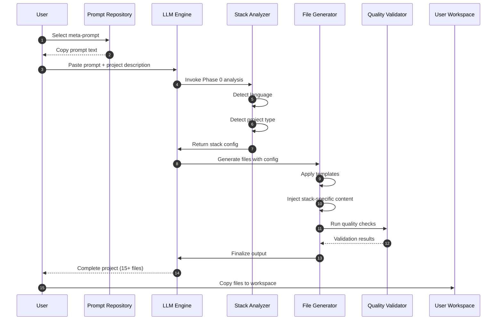
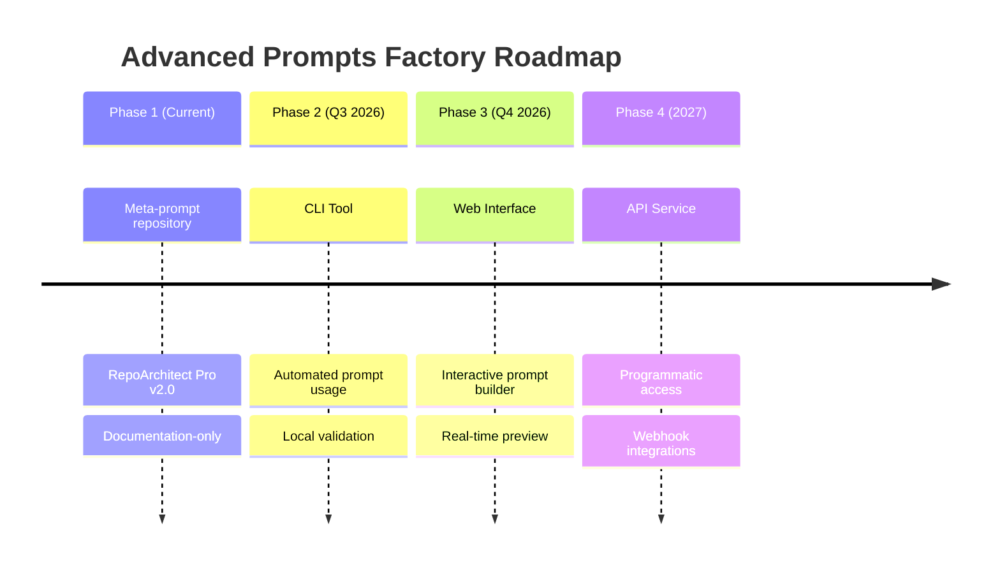

# Architecture Documentation

## Overview

Advanced Prompts Factory is a documentation-centric repository that provides meta-prompts for generating complete GitHub projects. The architecture is designed for simplicity, extensibility, and ease of use.

## System Architecture



## Component Breakdown

### 1. Prompt Repository

**Location**: `prompts/`

**Purpose**: Stores versioned meta-prompt templates

**Structure**:

```
prompts/
├── repoarchitect-pro.md      # Flagship meta-prompt
├── [future-prompt-1].md      # Future additions
└── [future-prompt-2].md
```

**Key Features**:

- Semantic versioning for each prompt
- Frontmatter metadata (version, stacks, types, author, date)
- Self-contained prompt specification
- Usage instructions embedded

**Metadata Schema**:

```yaml
Version: X.Y.Z
Stacks Supported: [comma-separated list]
Project Types: [comma-separated list]
Author: [GitHub username]
Last Updated: YYYY-MM-DD
```

### 2. Stack Knowledge Base

**Embedded in**: Meta-prompt Phase 0 logic

**Purpose**: Maps technology stacks to concrete implementation details

**Decision Matrix**:



**Stack Mappings**:

| Stack | Package Manager | Linter | Test Runner | CI Action | Build Tool |
|-------|----------------|--------|-------------|-----------|------------|
| PowerShell | PSGallery | PSScriptAnalyzer | Pester | setup-powershell | Invoke-Build |
| Node.js | npm/yarn/pnpm | ESLint | Jest/Vitest | setup-node@v4 | npm scripts |
| Python | pip/poetry | ruff/flake8 | pytest | setup-python@v5 | Makefile |
| Nix | nix flake | nixfmt | nix flake check | install-nix-action | nix build |
| Bash | N/A | shellcheck | bats | shellcheck-action | Makefile |

### 3. Template Library

**Embedded in**: Meta-prompt instructions

**Purpose**: Provides reusable file templates with placeholder injection points

**File Categories**:

1. **Documentation**: README.md (EN), README_FR.md (FR), CONTRIBUTING.md, CODE_OF_CONDUCT.md
2. **Legal**: LICENSE, SECURITY.md
3. **Versioning**: CHANGELOG.md
4. **Configuration**: .gitignore, .editorconfig, .markdownlint.json
5. **CI/CD**: .github/workflows/ci.yml, release.yml, dependabot.yml
6. **Templates**: Pull request template, issue templates
7. **Docs**: docs/architecture.md, docs/usage-examples.md

**Template Adaptation Flow**:



### 4. Quality Validation

**Location**: CI/CD workflows + embedded checklists

**Purpose**: Ensure generated projects meet quality standards

**Validation Layers**:



**Quality Checks**:

1. **Zero Placeholder**: No `[TODO]`, `[Description]`, `[Setup steps]` in output
2. **Executable Code**: All commands run without modification
3. **Stack Accuracy**: `.gitignore`, CI/CD, Makefile match detected stack
4. **Bilingual Completeness**: EN/FR sections present and translated
5. **Markdown Compliance**: Zero markdownlint violations
6. **Link Integrity**: All URLs and references valid

## Data Flow

### End-to-End Generation Flow



## Extensibility Points

### Adding New Meta-Prompts

1. **Create prompt file** in `prompts/`
2. **Follow standard structure**:
   - Frontmatter metadata
   - Overview section
   - Usage instructions
   - The meta-prompt content
   - Changelog (if update)
3. **Add to index** in `docs/prompts-index.md`
4. **Test with 3+ project types**
5. **Submit PR**

### Adding New Stack Support

1. **Extend Decision Matrix** in Phase 0 section
2. **Define stack mappings**:
   - Package manager
   - Linter
   - Test runner
   - CI action
   - Build tool
3. **Add .gitignore patterns**
4. **Document in README**
5. **Test generation**

### Adding New File Templates

1. **Identify file category** (docs, config, CI/CD, etc.)
2. **Create template** with placeholder markers
3. **Add to prompt instructions**
4. **Update quality checklist**
5. **Test with multiple stacks**

## Security Considerations

### Threat Model

| Threat | Mitigation |
|--------|------------|
| Malicious prompt injection | User reviews before execution |
| Generated code vulnerabilities | Quality checklist includes security review |
| Secrets in generated files | .gitignore templates exclude credentials |
| Supply chain attacks | Dependabot monitors action versions |

### Security Best Practices

1. **Review Generated Output**: Always inspect before committing
2. **Secrets Scanning**: Use GitHub secret scanning on generated repos
3. **Dependency Pinning**: CI/CD uses pinned action versions
4. **No Execution by Default**: Prompts generate code, don't execute it

## Performance Characteristics

### Token Efficiency

- **Average prompt size**: ~3,000 tokens
- **Average output size**: ~15,000-25,000 tokens (15+ files)
- **Total conversation cost**: ~30,000-40,000 tokens per project

**Optimization Strategies**:

- Single-pass generation (no iterative refinement)
- Compressed template syntax
- Stack detection reuses patterns across files

### Generation Time

- **LLM processing**: 30-90 seconds (depends on model)
- **User copy-paste**: 5-10 seconds
- **Total time**: < 2 minutes for complete project

## Maintenance

### Version Management

**Prompt Versioning**:

- Follow Semantic Versioning (SemVer)
- Breaking changes = major version bump
- New features = minor version bump
- Bug fixes = patch version bump

**Repository Versioning**:

- Tags: `v1.0.0`, `v1.1.0`, etc.
- Releases: GitHub Releases with changelog
- CHANGELOG.md: Keep a Changelog format

### Monitoring

**Metrics Tracked**:

- Prompt usage (via GitHub traffic)
- Issue frequency by prompt
- PR contribution rate
- Stack distribution (from issue templates)

## Future Architecture

### Roadmap



### Planned Enhancements

1. **CLI Tool**:
   - Command: `apt gen --prompt repoarchitect-pro --stack python`
   - Validates output locally
   - Git integration (auto-commit)

2. **Web Interface**:
   - Visual prompt customization
   - Stack selection dropdown
   - Real-time preview
   - One-click download

3. **API Service**:
   - REST API endpoints
   - Webhook support for CI/CD integration
   - Rate limiting and authentication

## Conclusion

Advanced Prompts Factory's architecture prioritizes:

- **Simplicity**: Documentation-only, no complex build systems
- **Extensibility**: Easy to add new prompts and stacks
- **Quality**: Multi-layer validation ensures reliable output
- **Performance**: Single-pass generation with token efficiency

The modular design allows future enhancements (CLI, web UI, API) without disrupting the core prompt repository.
