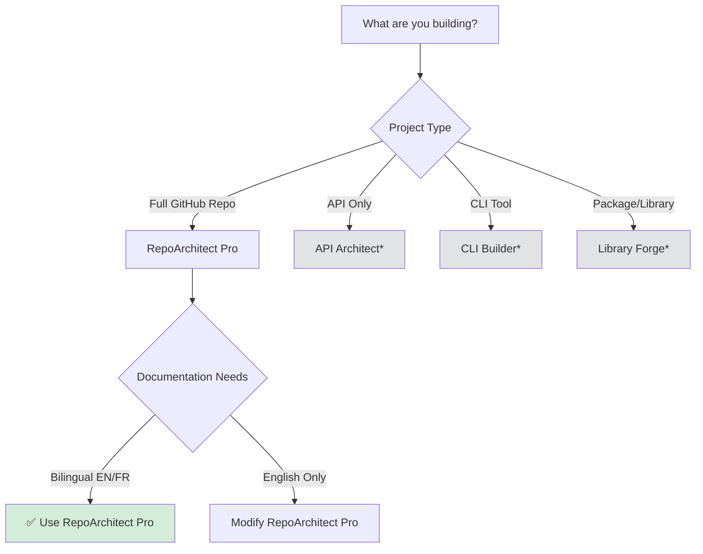

# Prompts Index

Complete catalog of all meta-prompts available in Advanced Prompts Factory.

## Available Prompts

| Prompt Name | Description | Version | Stacks Supported | Project Types | Status |
|-------------|-------------|---------|------------------|---------------|--------|
| [RepoArchitect Pro](../prompts/repoarchitect-pro.md) | Enterprise-grade GitHub project generation with stack-aware intelligence | v2.0.0 | PowerShell, Node.js, Python, Nix, Bash, Shell | CLI, Library, Web App, API, Scripts | ✅ Stable |

## Prompt Categories

### 🏗️ Repository Scaffolding

Prompts for generating complete repository structures with documentation, CI/CD, and standards compliance.

- **RepoArchitect Pro** - Full-featured project generation with bilingual documentation

### 🔮 Planned Additions

Future prompts in development:

- **API Architect** - REST API project generation with OpenAPI specs
- **CLI Builder** - Command-line tool scaffolding with argument parsing
- **Library Forge** - Package/library creation with publishing workflows
- **Microservices Architect** - Multi-service project with Docker Compose
- **Documentation Generator** - Standalone documentation site with MkDocs/Docusaurus

## Prompt Comparison Matrix

### Feature Comparison

| Feature | RepoArchitect Pro | API Architect* | CLI Builder* | Library Forge* |
|---------|-------------------|----------------|--------------|----------------|
| Bilingual (EN/FR) | ✅ | 🔮 | 🔮 | 🔮 |
| Zero Placeholders | ✅ | 🔮 | 🔮 | 🔮 |
| Stack Detection | ✅ | 🔮 | 🔮 | 🔮 |
| CI/CD Workflows | ✅ | 🔮 | 🔮 | 🔮 |
| Security Policy | ✅ | 🔮 | 🔮 | 🔮 |
| 15+ Files | ✅ | 🔮 | 🔮 | 🔮 |
| Mermaid Diagrams | ✅ | 🔮 | 🔮 | 🔮 |

*🔮 = Planned for future release*

### Stack Coverage

| Stack | RepoArchitect Pro | API Architect* | CLI Builder* | Library Forge* |
|-------|-------------------|----------------|--------------|----------------|
| PowerShell | ✅ | 🔮 | 🔮 | 🔮 |
| Node.js | ✅ | 🔮 | 🔮 | 🔮 |
| Python | ✅ | 🔮 | 🔮 | 🔮 |
| Nix/NixOS | ✅ | ❌ | 🔮 | ❌ |
| Bash/Shell | ✅ | ❌ | 🔮 | ❌ |
| Go | ❌ | 🔮 | 🔮 | 🔮 |
| Rust | ❌ | 🔮 | 🔮 | 🔮 |
| TypeScript | Partial (via Node.js) | 🔮 | 🔮 | 🔮 |

## Usage Guidance

### When to Use RepoArchitect Pro

**Ideal for**:

- Starting a new open-source project from scratch
- Creating GitHub repos with enterprise-grade standards
- Projects requiring bilingual documentation (separate README.md and README_FR.md files)
- Multi-stack environments where stack detection is valuable

**Best project types**:

- CLI tools with complex documentation needs
- Libraries targeting open-source community
- Web apps with CI/CD requirements
- API projects requiring comprehensive docs

**Not recommended for**:

- Quick prototypes or throwaway code
- Internal projects without documentation requirements
- Projects with very specific/niche stack configurations not in support matrix

### Choosing the Right Prompt

## Prompt Statistics

### RepoArchitect Pro v2.0

- **First Released**: 2026-05-29
- **Last Updated**: 2026-05-29
- **Files Generated**: 15-18 (depends on project type)
- **Stacks Supported**: 6 (PowerShell, Node.js, Python, Nix, Bash, Universal)
- **Token Usage**: ~3,000 tokens (prompt) + ~20,000 tokens (output)
- **Generation Time**: 30-90 seconds (model-dependent)

### Version History

| Version | Release Date | Key Changes |
|---------|--------------|-------------|
| v2.0.0 | 2026-05-29 | Added Phase 0 stack analysis, zero-placeholder guarantee, bilingual support |
| v1.0.0 | N/A (Internal) | Initial concept with generic templates |

## Contributing New Prompts

Interested in adding a new meta-prompt? See [CONTRIBUTING.md](../CONTRIBUTING.md) for guidelines.

### Prompt Submission Checklist

- [ ] Prompt follows standard structure (frontmatter, overview, usage, content)
- [ ] Tested with 3+ different project descriptions
- [ ] Supports at least 2 technology stacks
- [ ] Generates 10+ files minimum
- [ ] Documentation is bilingual (if applicable)
- [ ] Added to this index with metadata
- [ ] CHANGELOG.md updated

## External Resources

### Related Tools

- **GitHub Copilot**: AI pair programmer (complements prompt-based generation)
- **Yeoman**: Classic scaffolding tool (more imperative, less LLM-driven)
- **Cookiecutter**: Python project templates (less flexible than LLM prompts)

### Community Prompts

Have you created a derivative prompt? Share it:

- Open a [discussion](https://github.com/valorisa/Advanced-Prompts-Factory/discussions)
- Tag it with `community-prompt`
- Consider submitting as a PR for inclusion

## FAQ

### How do I request a new prompt?

Open a [feature request](https://github.com/valorisa/Advanced-Prompts-Factory/issues/new?template=feature_request.md) with:

- Desired project type
- Target stacks
- Key features needed
- Example use case

### Can I modify existing prompts?

Yes! Prompts are MIT-licensed. You can:

- Fork and customize for your needs
- Remove bilingual sections if not needed
- Add custom file templates
- Change stack detection logic

### Why isn't my stack supported?

We prioritize stacks based on:

- Community demand (GitHub stars, issue requests)
- Maintainer expertise
- Ecosystem maturity

Request support via [feature request](https://github.com/valorisa/Advanced-Prompts-Factory/issues/new?template=feature_request.md).

### How often are prompts updated?

- **Patch updates**: As bugs are reported
- **Minor updates**: Monthly (new features, stack additions)
- **Major updates**: Quarterly (breaking changes, architecture shifts)

---

**Last Updated**: 2026-05-29  
**Total Prompts**: 1  
**Supported Stacks**: 6  
**Project Types**: 6
